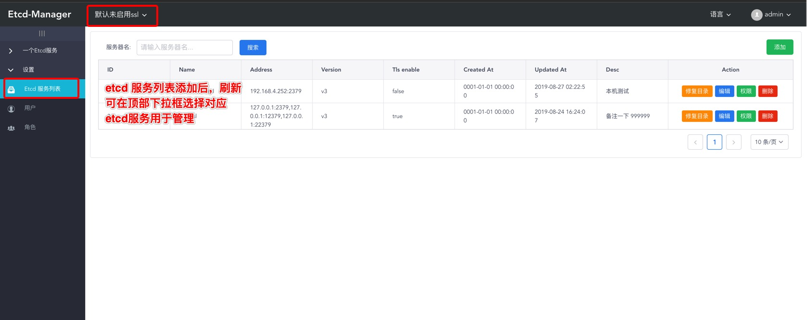
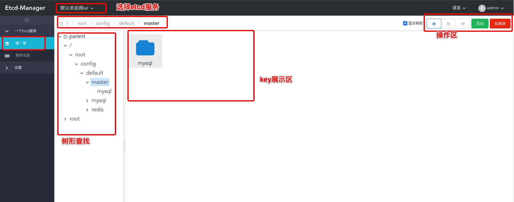
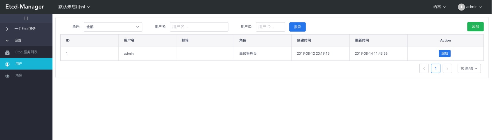

# etcd-manage

## 功能介绍

etcd-manage 是一个用go编写的etcd管理工具，具有友好的界面(类似阿里云后台)，管理key就像管理本地文件一样方便。支持简单权限管理区分只读和读写权限。

开源地址： [https://github.com/etcd-manage](https://github.com/etcd-manage)

**备注**

1. 用helm部署时注意修改mysql连接相关信息
2. 将sql文件导入到mysql数据库，默认用户 admin/111111 [etcd-manage.sql](sql/etcd-manage.sql)
3. 此程序为2.0版本，实现1.0功能 1.0项目地址 [https://github.com/shiguanghuxian/etcd-manage](https://github.com/shiguanghuxian/etcd-manage)
4. 下一步开发对中英双语言做全面支持，当前对中文支持友好。
5. 当前只实现了etcd v3 api管理key v2在路上。
6.  在使用时可直接修改默认的两个etcd连接地址为真实可用地址即可开始体验。


## 安装使用

提示：安装后通过kubectl get pods看到两个pod专题都是Running表示服务可用，首次mysql需要初始化会慢一些，大概1分钟。

```shell
helm install my-etcd-manage etcd-manage
或
cd path/etcd-manage
helm package .
helm install my-etcd-manage etcd-manage-1.0.0.tgz

```

运行后看到输出：

```shell
NAME: my-etcd-manage
LAST DEPLOYED: 2019-08-26 20:16:23.182943 +0800 CST m=+0.068774555
NAMESPACE: default
STATUS: deployed

NOTES:
1. Get the application URL by running these commands:
  export POD_NAME=$(kubectl get pods -l "app=etcd-manage,release=my-etcd-manage" -o jsonpath="{.items[0].metadata.name}")
  echo "Visit http://127.0.0.1:10280 to use your application"
  kubectl port-forward $POD_NAME 10280:10280

# kubectl get pods
NAME                                  READY   STATUS    RESTARTS   AGE
my-etcd-manage-f4bc496f5-bpg99        0/1     Running   2          25s
my-etcd-manage-mysql-5577cd9b-4nqr2   1/1     Running   0          25s

```

执行完 NOTES 中提示命令的命令即可在浏览器中访问 `http://127.0.0.1:10280` 查看。

如果NOTES命令执行错误可执行

```shell
kubectl port-forward my-etcd-manage-f4bc496f5-bpg99 10280:10280 // my-etcd-manage-f4bc496f5-bpg99 为 kubectl get pods 中获取的值
```

## 使用参数

使用数据库参数可使用自己mysql服务，默认使用依赖的charts中mysql服务，如果使用自己mysql请导入sql文件 [etcd-manage.sql](sql/etcd-manage.sql)

```shell
helm install my-etcd-manage etcd-manage --set database.address="你的数据库ip地址" --set database.port=3306 --set database.user="user" --set database.passwd="密码" --set database.db_name="etcd-manage"
```

**参数介绍**

| 参数名 | 简述 | 示例 |
| ----- | ----- | ---|
|  database.address | mysql数据库地址 | 192.168.1.88 |
|  database.port | mysql数据库端口 | 3306 |
|  database.user | mysql用户名 | root |
|  database.passwd | mysql用户密码 | z123456 |
|  database.db_name | 导入etcd-manage.sql的数据库 | etcd-manage |


## 效果演示

etcd服务列表管理



key 管理



key 编辑


用户管理


