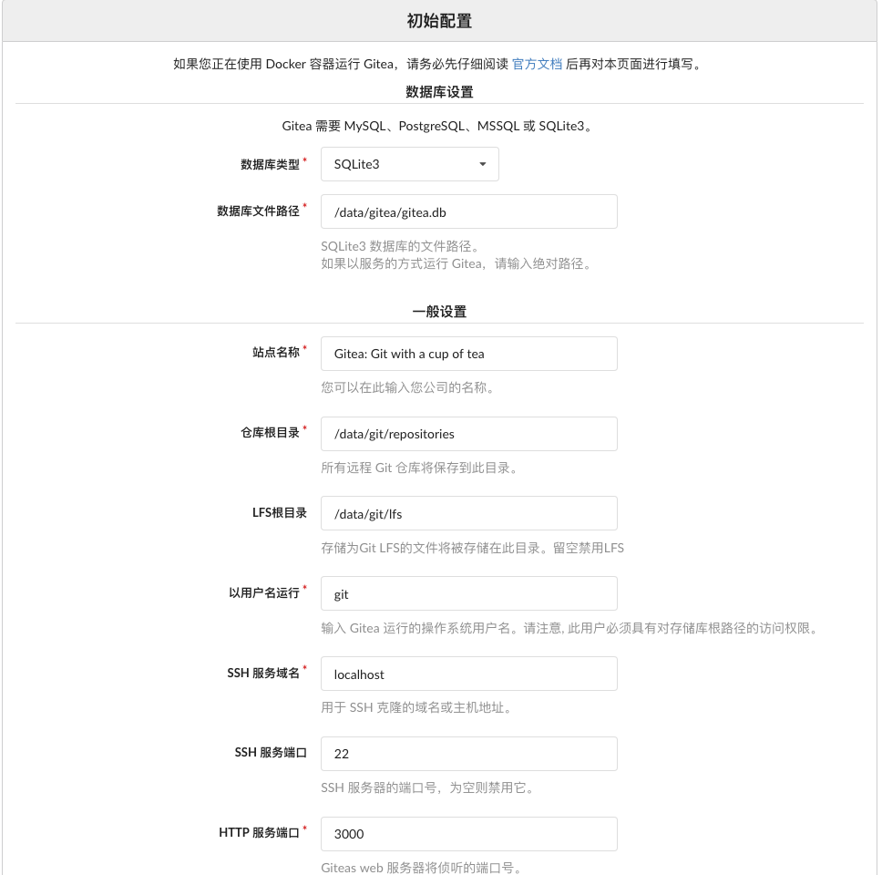
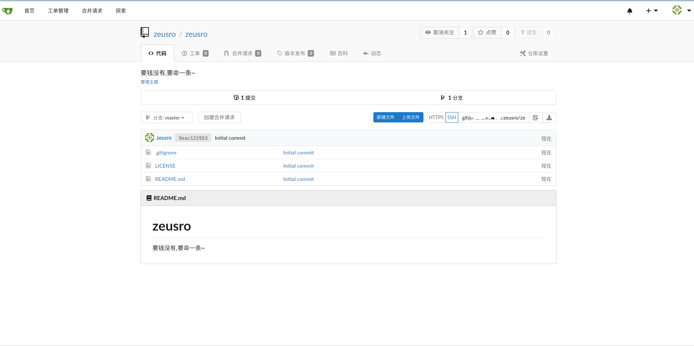

# gitea





## 功能介绍

gitea 是 gogs 的一个分支,不过 gitea 后续的发展已经跟 gitea 相去胜远.

如果对源代码管理系统要求不是特别多,gitea 是一个较好的选择(拉取,推送快)

## 安装使用

安装 helm3 之后,按需修改 values.yaml

volume 必须配置.发布方式有2种,第一种是 ingress,第二种是 lb svc 绑定 SLB.个人推荐用 lb svc.

**使用 ingress 发布只能使用 http 的方式拉取代码(ingress没有22端口).**

### ingress 安装方式

```
helm install \
--set expose.ingress.host=www.zeusro.tech \
--set expose.type=ingress \
--set expose.tls.enabled=true \
--set expose.ingress.enabled=true \
--set expose.tls.secretName=tls-zeusro.tech \
mygitea \
gitea
```

效果

```
NAME                          READY   STATUS    RESTARTS   AGE
pod/mygitea-7b948796d-lhd52   0/1     Running   0          8s


NAME              TYPE        CLUSTER-IP   EXTERNAL-IP   PORT(S)         AGE
service/mygitea   ClusterIP   172.30.5.7   <none>        22/TCP,80/TCP   8s


NAME                      DESIRED   CURRENT   UP-TO-DATE   AVAILABLE   AGE
deployment.apps/mygitea   1         1         1            0           8s

NAME                                DESIRED   CURRENT   READY   AGE
replicaset.apps/mygitea-7b948796d   1         1         0       8s
```

### lb svc

修改
expose.loadBalancer.annotations

```
helm install \
--set expose.type=LoadBalancer \
mygitea \
gitea
```

效果

```
NAME                          READY   STATUS    RESTARTS   AGE
pod/mygitea-7b948796d-sqmbx   1/1     Running   0          13s


NAME              TYPE           CLUSTER-IP    EXTERNAL-IP   PORT(S)                     AGE
service/mygitea   LoadBalancer   172.30.7.76   <pending>     22:30068/TCP,80:31248/TCP   13s


NAME                      DESIRED   CURRENT   UP-TO-DATE   AVAILABLE   AGE
deployment.apps/mygitea   1         1         1            1           13s

NAME                                DESIRED   CURRENT   READY   AGE
replicaset.apps/mygitea-7b948796d   1         1         1       13s
```

支持SSH 拉取仓库

```
➜  temp git clone git@www.zeusro.tech:zeusro/zeusro.git
Cloning into 'zeusro'...
Are you sure you want to continue connecting (yes/no)? yes
Warning: Permanently added 'www.zeusro.tech' (ECDSA) to the list of known hosts.
Offending key for IP in /Users/zeusro/.ssh/known_hosts:18
Are you sure you want to continue connecting (yes/no)? yes
remote: Enumerating objects: 5, done.
remote: Counting objects: 100% (5/5), done.
remote: Compressing objects: 100% (4/4), done.
remote: Total 5 (delta 0), reused 0 (delta 0)
Receiving objects: 100% (5/5), done.
```

## 注意事项

Gitea 需要 MySQL、PostgreSQL、MSSQL 或 SQLite3.

在初始化时会要求你填入,这里就不用容器部署数据库了.

`SSH 服务域名` 和 `Gitea 基本 URL` 建议一开始设置好,这个会生成 `app.ini` 配置文件,这个配置文件在 `/data` 目录里面,只能通过文件方式修改.
