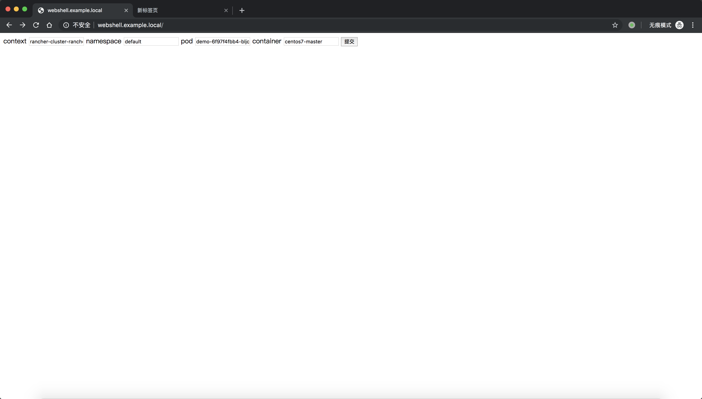
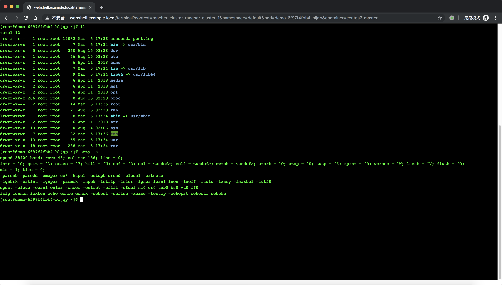

# Kube-WebShell

## 介绍
[Kubernetes WebShell](https://github.com/lf1029698952/kube-webshell) Terminal By Sahaba Team

参考kube-dashboard提取出来的容器网页版终端，通过web浏览器连接k8s容器。  

基于xterm.js和sockjs实现，简单轻量。  
需要提供kubeconfig文件，使用时传递以下参数：  

- context
- namespace
- podname
- containername

## 功能

- 多集群支持
- web终端实现，自带心跳保活
- 自适应浏览器窗口并动态调整tty大小


## 使用:

### Helm 安装
支持helm安装：

#### Prerequisites

- Kubernetes 1.6+
- helm 2.8.0+

#### Installation
```
git clone https://github.com/lf1029698952/kube-webshell.git
cd kube-webshell/helm-chart
```
将目标集群的kubeconfig文件内容替换至kubeconfig.toml文件下，支持多contexts集群配置，然后执行：
```
helm install kube-webshell kube-webshell
```

#### 配置values.yaml文件

可在values.yaml中修改如下配置，或在helm install中使用--set选项

- **Ingress**: The ingress controller must be installed in the Kubernetes cluster.  
- **ClusterIP**: Exposes the service on a cluster-internal IP. Choosing this value makes the service only reachable from within the cluster.
- **NodePort**: Exposes the service on each Node’s IP at a static port (the NodePort). You’ll be able to contact the NodePort service, from outside the cluster, by requesting `NodeIP:NodePort`. 
- **LoadBalancer**: Exposes the service externally using a cloud provider’s load balancer.  

### 访问
使用Ingress暴露服务时，绑定host或解析webshell.example.local域名，直接浏览器访问即可  
使用NodePort暴露服务时，浏览器直接访问NodeIP:NodePort  
使用ClusterIP时，外部无法直接访问，使用port-forward命令将服务暴露至本地：
```
kubectl port-forward <PodName> 8080:8080
```

浏览器访问localhost:8080  

如图：



演示：
[kube-webshell](images/kube-webshell.mov)

### 删除安装

To uninstall/delete the kube-webshell deployment

```bash
# helm v2
helm delete --purge kube-webshell

# helm v3
helm uninstall kube-webshell
```
