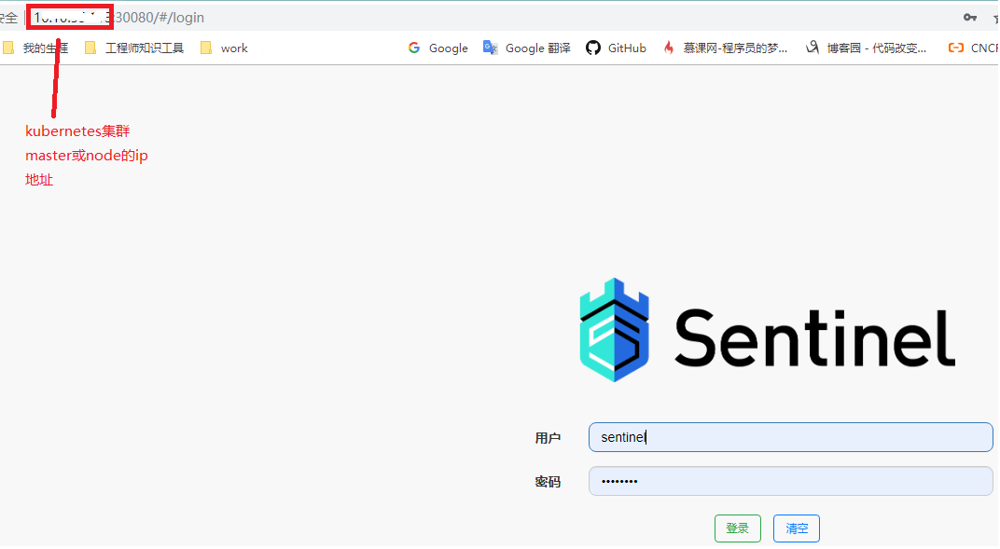

# sentinel-dashboard

## 功能介绍:

功能: alibabab开源的sentinel，限流工具

[https://github.com/alibaba/Sentinel](https://github.com/alibaba/Sentinel)

## 安装方式:
ip-address请换成kubernetes集群master或node的ip
```shell
helm install sentinel-dashboard sentinel-dashboard  --set DASHBOARD_SERVER="ip-address:30080"
```

运行后将看到如下信息
```shell
NAME: sentinel-dashboard
LAST DEPLOYED: 2019-08-29 16:50:14.456808972 +0800 CST m=+0.116678773
NAMESPACE: default
STATUS: deployed

NOTES:
alibaba sentinel-dashboard
1. Get the application URL by running these commands:
  export NODE_PORT=$(kubectl get -o jsonpath="{.spec.ports[0].nodePort}" services sentinel-dashboard)
  export NODE_IP=$(kubectl get nodes -o jsonpath="{.items[0].status.addresses[0].address}")
  echo http://$NODE_IP:$NODE_PORT
```

查看kubernetes对象
```shell
➜ kubectl get pods
NAME                                   READY   STATUS    RESTARTS   AGE     IP             NODE               NOMINATED NODE   READINESS GATES
sentinel-dashboard-5548f9fbd8-5ltpl    1/1     Running   0          4m35s   10.244.1.26    cbov10-sso55-114   <none>           <none>

➜ kubectl get deployments
NAME                  READY   UP-TO-DATE   AVAILABLE   AGE    CONTAINERS           IMAGES                                    SELECTOR
sentinel-dashboard    1/1     1            1           5m6s   sentinel-dashboard   haoprogrammer/sentinel-dashboard:v1.6.3   app.kubernetes.io/instance=sentinel-dashboard,app.kubernetes.io/name=sentinel-dashboard
➜ kubectl get service
NAME         TYPE        CLUSTER-IP      EXTERNAL-IP   PORT(S)    AGE
kubernetes           ClusterIP   10.96.0.1        <none>        443/TCP          132d
sentinel-dashboard   NodePort    10.109.150.179   <none>        8080:30080/TCP   5m35s
```


## Example
本例通过NodePort访问服务，如下图所示
- 访问地址(监控页面): `<nodeip:nodeport>`
- 默认用户名密码均为sentinel



### 3. 其他备注

#### 环境变量说明
DASHBOARD_SERVER 指定Sentinel-dashboard访问ip:port
JAVA_OPTS 指定其他 JVM 参数,如日志路径：-Dcsp.sentinel.log.dir=/usr/local/Sentinel/logs/csp/

#### 其他 JVM 可用参数
参看官方文档
[Sentinel 控制台](https://github.com/alibaba/Sentinel/wiki/%E6%8E%A7%E5%88%B6%E5%8F%B0)
[参数列表](https://github.com/alibaba/Sentinel/wiki/%E5%90%AF%E5%8A%A8%E9%85%8D%E7%BD%AE%E9%A1%B9#%E5%8F%82%E6%95%B0%E5%88%97%E8%A1%A8)


#### docker镜像

[https://cloud.docker.com/u/haoprogrammer/repository/docker/haoprogrammer/sentinel-dashboard](https://cloud.docker.com/u/haoprogrammer/repository/docker/haoprogrammer/sentinel-dashboard)
