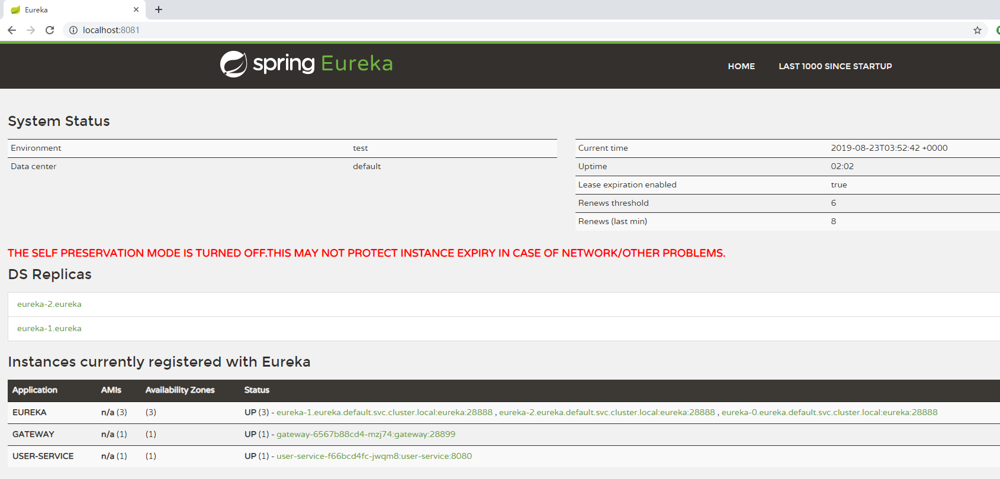

# spring-cloud-eureka

## 功能介绍

通过`spring-cloud-eureka`可以快速创建[spring cloud oss](https://spring.io/projects/spring-cloud-netflix)套件里的注册中心服务，即[eureka集群](https://cloud.spring.io/spring-cloud-netflix/multi/multi_spring-cloud-eureka-server.html)。效果如下图所示：



## 安装使用

### 本地安装
```shell
helm install spring-cloud-eureka spring-cloud-eureka/

```

成功安装后可以看到如下输出：
```shell
NAME: spring-cloud-eureka
LAST DEPLOYED: 2019-08-23 09:37:26.2652075 +0800 CST
NAMESPACE: default
STATUS: deployed
```

### 查看部署好的workload：
```shell
# 查看eureka statefulset
> kubectl get sts
NAME     READY   AGE
eureka   3/3     20s
# 查看eureka pod
> kubectl get pod
NAME                           READY   STATUS    RESTARTS   AGE
eureka-0                       1/1     Running   0          110s
eureka-1                       1/1     Running   0          108s
eureka-2                       1/1     Running   0          105s
```
### 访问eureka页面
```shell
> kubectl port-forward eureka-0 8081:28888

Forwarding from 127.0.0.1:8081 -> 28888
Forwarding from [::1]:8081 -> 28888
Handling connection for 8081
Handling connection for 8081

```

浏览器访问 http://localhost:8081， 效果如上文所示。
